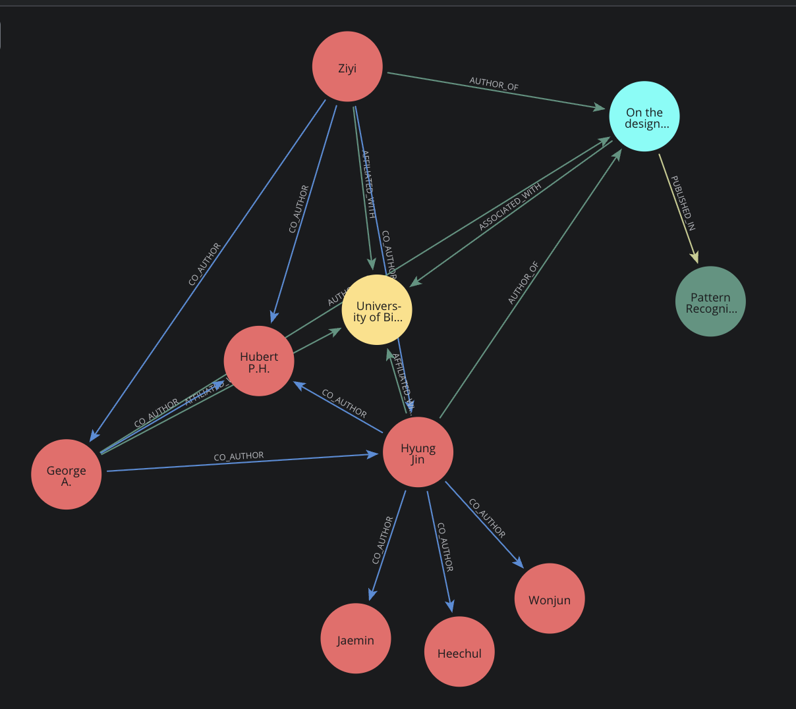

# Create Neo4j Database with Scopus Data

[](https://www.repostatus.org/#inactive)

This project stores code and documentation for the creation of a graph database management system called [Neo4j](https://neo4j.com), populated with [Scopus](https://www.elsevier.com/en-gb/products/scopus) data. 

For a light-weight interactive introduction, see [dummy_data](dummy_data). Below, we document [scopus_data](scopus_data), containing a Python module that reads from a Scopus json and creates a Neo4j database with nodes and relationships, utilising more data and software best practices. 

1. [Installation and set-up](#installation-and-set-up)
2. [Running the create_database module](#running-the-create_database-module)
   - [Time and size estimates](#time-and-size-estimates)
   - [Example Run](#example-run)
3. [Loading the database from file](#loading-database-from-file)
4. [Database design](#database-design)
5. [Explore the graph](#explore-the-graph)
6. [Contributing](#contributing)
   - [Code Developers - please read!](#code-developers---please-read)

## Installation and set-up

### Create a virtual python env with the required packages

Make a virtual python environment called venv_neo4j using the [requirements.txt](requirements.txt) file to install the required dependencies. On a shell terminal, these are the steps:
- Create virtual Python environment: `python3 -m venv venv_neo4j`
- Activate environment: `source venv_neo4j/bin/activate`
- Install the required packages: `pip install -r requirements.txt` 

### Neo4j database setup
Specific for MacOS on a shell terminal:
- `brew install neo4j`
- `neo4j start` 
- go to http://localhost:7474 in browser, change password from the default
- store your password in your .env file as 'neo4j_password' (see [.env_template](.env_template))

### Input data  

It is assumed that you downloaded a Scopus json file from the Research Data Store. If you put these json files inside a folder called large_files this will not be tracked by git, as defined in [.gitignore](.gitignore).

> The query responses are stored as json files on the Research Data Store (/rdsprojects/m/missierp-ai4idai/scopus_data). **If you are granted access to these and use them for your UoB research, it is assumed that you have read and agreed to the [API Service Agreement](https://dev.elsevier.com/policy/API-service-agreement.pdf), and also read Elsevier's policy on [Scopus API for academic research](https://dev.elsevier.com/academic_research_scopus.html).**

Alternatively to using these files, you can generate your own, see [scopusscrap] or use another method. 

## Running the create_database module

Simply run `python create_database.py <your-scopus-json-file>` in your terminal of choice to create the database. 

### Time and size estimates

Estimates based on running locally on an Apple M3 (8GB):

- For the smaller json files (Q1, Q2, Q4 and Q5 - fewer than 3218 Scopus entries), the code ran in less than 1-minute. For Q4 as an example, the database results in 21,078 nodes and 303,408 relationships. 
- For the largest Scopus json file (Q6 - 64137 Scopus entries) the code ran in about 30 minutes. This database results in 310,557 nodes and 6,348,597 relationships. 

### Example Run

Below we see a preview of the terminal outputs, for an example run.

`python3 create_database.py ../large_files/Q6_64137_papers_2025-07-22_10-53-29.json`

```
✅ Scopus data loaded and cleaned.

✅ Successfully connected to the neo4j graph database

⚠️ Do you want to delete all current nodes and relationships from the graph?

⚠️ This action cannot be undone. (yes/no): yes

Remaining nodes: 0

✅ 🗑️ Graph cleared successfully

✅ Node definitions loaded successfully from file

✅ Node constraints created

⏳ Creating/updating nodes and relationships ...
 
Processing batch 1 of 642
...
Processing batch 642 of 642
```
```
              DateTime         Node  Created  Matched  Updated
0  2025-07-30 14:41:19     Document    64137        0        0
1  2025-07-30 14:41:19  Publication    13632    50351      149
2  2025-07-30 14:41:19  Affiliation    29688   415567        0
3  2025-07-30 14:41:19       Author   201998   428603    79588
```
```
               DateTime       Relationship    Count
0   2025-07-30 15:17:10  AUTH_PUBLISHED_IN   408179
1   2025-07-30 15:17:10   DOC_PUBLISHED_IN    64132
2   2025-07-30 15:17:10          AUTHOR_OF   709274
3   2025-07-30 15:17:10          CO_AUTHOR  4872696
4   2025-07-30 15:17:10    AFFILIATED_WITH   278470
```
```
💡 Open http://localhost:7474 to visualise your database.

✅🔒 Database connection closed successfully
```

## Loading database from file

Alternatively to [Running the create_database module](#running-the-create_database-module), if you're been provided with a `.dump` file you can restore it locally.

```
neo4j stop
neo4j-admin database load neo4j --from-path=/Q6 --overwrite-destination=true
neo4j start
```

Please note, this will overwrite any existing database you have called neo4j (it would be better to call it something else but neo4j community edition only allows one database!). Consider whether you need to save a database dump file first, before loading in another:

```
neo4j stop
neo4j-admin database dump neo4j --to-path=/Q1
neo4j start
```

See [neo4j docs](https://neo4j.com/docs/operations-manual/current/kubernetes/operations/dump-load/) for best practices. 

When the database is restored locally, you’ll need more space than the dump file, maybe 2 or 3 times the size of the dump file. This is because (1) the dump file is compressed; (2) some database properties are not fully stored in the file, but are rebuilt during the restore process, which then increases the on-disk size; (3) the restored database needs space for transaction logs; (4) the database pre-allocate some disk spaces to optimise performance. 

## Database design



This is based on the Scopus data but other data sources that can be reliably linked to the property keys of any of these node can theoretically be brought into the same graph database. 

### Nodes

- **Document** node has the most property keys, for example many identifiers, date of publication, title, abstract text, keywords, author count, funding information, number of citations, open access information. 
- **Publication** node has publication id, name, type, and issn numbers. 
- **Author** node has the author id,  orcid, first name, surname and initials. It has affiliation ids (derived from multiple documents) stored as a list.
- **Affiliation** node has the affiliation id, name, city and country. 

UPDATING: For the **Document** node, if a duplicate id (primary key) is encountered, it will not create a new node, ensuring each document is unique and not updated. For the other nodes, if duplicate primary keys are encountered on data ingress, we will not replace the node but we will attempt to merge information. For example, two unique documents can have the same author, but we do not want to store this author node twice; we need to check if the property keys agree. If they do not agree, we need to normalise into one value or store alternative values (for example, a different spelling of a author name) - for now, we store all alterative values as property keys on that node. However, for the **Author** node, we iteratively update a list of affiliations rather than storing these as alternative values. All of this will be tracked in log files.

### Relationships

The id for the **Document** node is stored as a list within the property keys of the **AFFILIATED_WITH**, **AUTH_PUBLISHED_IN**, **CO_AUTHOR** relationships, so that the origin of these relationships can be exhaustively tracked. The **DOC_PUBLISHED_IN** and **AUTHOR_OF** relationships store the date of publication. 

We can choose to make inverse relationships of any of these, or simply query in reverse (e.g. **AUTHOR_OF** goes to **HAS_AUTHOR**).

## Explore the graph!

We can use the Cypher query language to query the graph database with text based queries. Below are some ideas for queries, which is not an exhaustive list. The query will naturally depend on the question you are trying to address or the analysis to be performed. 

Open up http://localhost:7474 and explore the nodes and relationships by clicking on them. 

Clicking on them runs a Cypher query, for example these queries will show you 300 Documents and 300 AFFILIATED_WITH relationships:

```
MATCH (n:Document) RETURN n LIMIT 300;

MATCH p=()-[:AFFILIATED_WITH]->() RETURN p LIMIT 300;
```


### Filter for authors that have been a last author

```
MATCH (auth:Author)-[:AUTHOR_OF]->(doc:Document)
WHERE auth.authid = LAST(doc.author)
RETURN auth.authid AS LastAuthor, doc.eid AS DocumentID
```
Try `HEAD()` instead of `LAST()` for first author

### Filter by open access

```
MATCH (auth:Author)-[:AUTHOR_OF]->(doc:Document)
WHERE doc.openaccessFlag = true
RETURN auth.authid AS Author, doc.eid AS DocumentID, doc.openaccessFlag AS OpenAccess
```

### Filter on a relationship key (e.g. date) and display

Display all relationships showing where a document was published, but only after 1st January 2024. 

```
MATCH (doc:Document)-[rel:DOC_PUBLISHED_IN]->(pub:Publication)
WHERE date(rel.date) > date("2024-01-01")
RETURN doc, rel, pub
LIMIT 100;
```

> Many of the next queries are using 'Publication' as a stand in for topic or domain - word embeddings and LLM approaches would help bring more specificity this (Document nodes have titles, abstracts and keywords) allowing for authors to be grouped by semantic topic and then matched on similarity. 

### Authors published in the same place but have never co-authored
```
MATCH (auth1:Author)-[:AUTHOR_OF]->(doc1:Document)-[:DOC_PUBLISHED_IN]->(pub:Publication),
      (auth2:Author)-[:AUTHOR_OF]->(doc2:Document)-[:DOC_PUBLISHED_IN]->(pub)
WHERE auth1 <> auth2  
  AND NOT EXISTS {    
    MATCH (auth1)-[:CO_AUTHOR]-(auth2)
  }
RETURN DISTINCT auth1.authid AS Author1, auth2.authid AS Author2, pub.prism_publicationName AS SharedPublication
LIMIT 100;
```

### Authors that share an affiliation, have published in the same place, but have never co-authored

```
MATCH (auth1:Author)-[:AFFILIATED_WITH]->(aff:Affiliation)<-[:AFFILIATED_WITH]-(auth2:Author),
      (auth1)-[:AUTH_PUBLISHED_IN]->(pub:Publication),
      (auth2)-[:AUTH_PUBLISHED_IN]->(pub:Publication)
WHERE auth1 <> auth2  
  AND NOT EXISTS {    
    MATCH (auth1)-[:CO_AUTHOR]-(auth2)
  }
RETURN DISTINCT auth1.authid AS Author1, auth2.authid AS Author2, aff.affilname AS SharedAffiliation, pub.prism_publicationName AS SharedPublication
LIMIT 100;
```

### Authors with a high number of affiliations (rank)

```
MATCH (auth:Author)-[:AFFILIATED_WITH]->(aff:Affiliation)
WITH auth, COUNT(DISTINCT aff) AS affiliationCount
WHERE affiliationCount > 1
RETURN auth.authid AS AuthorID, affiliationCount
ORDER BY affiliationCount DESC
LIMIT 100;
```

### Authors that have published across multiple publications (rank)

```
MATCH (auth:Author)-[:AUTH_PUBLISHED_IN]->(pub:Publication)
WITH auth, COUNT(DISTINCT pub) AS pubCount
WHERE pubCount > 1
RETURN auth.authid AS AuthorID, pubCount
ORDER BY pubCount DESC
LIMIT 100;
```
## Contributing to the project

If you want to suggest and/or contribute changes to the code or documentation, that is welcome. Please refer to the [README.md for the whole project](https://gitlab.bham.ac.uk/missierp-ai4idai), specifically the section on [How to contribute in GitLab](https://gitlab.bham.ac.uk/missierp-ai4idai#how-to-contribute-in-gitlab). 

This is work in progress; there are many more data and software best practices that can be implemented. To see currently tracked bugs or improvements, go to the [GitLab Issues](https://gitlab.bham.ac.uk/missierp-ai4idai/neo4j/-/issues). 

### Code Developers - please read!

Dear future developer(s), you need to run the existing tests locally on your machine. The tests assume you have Docker installed locally. We assume that the development (live) database is on port 7687 and the test database is on port 8765 - **do not change these unless you fully know what you are doing.** This is a consequence of the fact that neo4j community edition only gives you two database to work with - system and neo4j - and you cannot easily create a test database. So for now we've just made the test database separate to the development database by containerising it with Docker and putting it on a different port. Unfortunately, these tests are not running easily on CI due to the use of the Docker container not being supported on the current GitLab runners. Moving this code from local environments to production environments will need a new approach for testing - the current set-up is assuming you are running the code locally with neo4j community edition. 